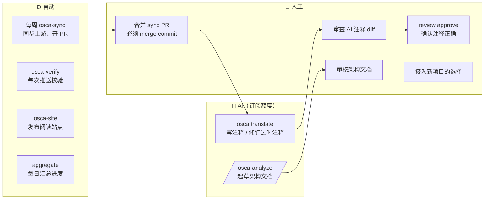

# OSCA 使用手册

> 本手册覆盖 OpenSource Code Atlas 的完整使用流程：环境准备、翻译、上游同步、人工审核、架构文档、接入新项目、升级维护，以及全部命令与故障排查。
>
> 标记说明：**👤 人工** = 必须由人完成或确认的步骤；**🤖 AI** = 由 Claude 完成、结果需人工审核；**⚙️ 自动** = 工具或 CI 自动完成。

---

## 目录

1. [一图看懂：谁做什么](#1-一图看懂谁做什么)
2. [一次性环境准备](#2-一次性环境准备)
3. [核心概念速查](#3-核心概念速查)
4. [流程 A：翻译一个模块](#4-流程-a翻译一个模块)
5. [流程 B：上游发布新版本](#5-流程-b上游发布新版本)
6. [流程 C：人工审核（重点）](#6-流程-c人工审核重点)
7. [流程 D：撰写架构分析文档](#7-流程-d撰写架构分析文档)
8. [流程 E：接入新项目](#8-流程-e接入新项目)
9. [流程 F：升级模板与工具](#9-流程-f升级模板与工具)
10. [流程 G：维护总仓库](#10-流程-g维护总仓库)
11. [例行检查清单](#11-例行检查清单)
12. [命令参考](#12-命令参考)
13. [verify 错误码与故障排查](#13-verify-错误码与故障排查)
14. [人工操作汇总](#14-人工操作汇总)

---

## 1. 一图看懂：谁做什么



**原则：AI 只负责“写”，正确性永远由人确认。** AI 写的注释状态是“已翻译”，只有人执行 `osca review approve` 后才变为“已审核”。

---

## 2. 一次性环境准备

### 2.1 需要的工具

| 工具 | 用途 | 安装 / 检查 |
|---|---|---|
| git | 版本管理 | `git --version` |
| GitHub CLI | 建仓库、PR、工作流 | `gh --version`；登录：`gh auth login`（选 SSH） |
| uv | 安装 osca、运行 copier | `curl -LsSf https://astral.sh/uv/install.sh \| sh` |
| Claude Code | AI 翻译（使用订阅额度） | `claude --version`；首次运行 `claude` 登录订阅账号 |
| Rust 工具链（可选） | 本地 `cargo check` / `cargo doc` 验证 | `rustup show` |

> 没有 API Key 也能用：`osca translate` 默认通过本机 Claude Code（`claude -p`）消耗订阅额度。
> 有 API Key 时可用 `--backend api`，并可用 `--batch` 走批处理接口（半价）。

### 2.2 安装 osca

```bash
# 普通安装（跟随总仓库 main）
uv tool install "git+https://github.com/dajy5120/opensource-code-atlas#subdirectory=tools/osca"

# 开发安装（本地修改工具代码后立即生效）
git clone git@github.com:dajy5120/opensource-code-atlas.git
uv tool install -e opensource-code-atlas/tools/osca

osca version
```

### 2.3 获取仓库

```bash
mkdir -p ~/dev/OSCA && cd ~/dev/OSCA
git clone git@github.com:dajy5120/opensource-code-atlas.git        # 总仓库
git clone git@github.com:dajy5120/osca-nautilus-trader.git          # 学习仓库
cd osca-nautilus-trader
git remote add upstream https://github.com/nautechsystems/nautilus_trader   # 上游
git fetch upstream --tags
git branch mirror/develop origin/mirror/develop                     # 镜像分支（本地）
```

> 学习仓库很大时（如 NautilusTrader，约 300 MB 历史），首次 `clone` 需要几分钟。
> 首次运行 `osca status` 会建立符号索引（数秒），之后使用 `.git` 中的缓存。

---

## 3. 核心概念速查

### 3.1 两类仓库

| 仓库 | 内容 |
|---|---|
| `opensource-code-atlas`（总仓库） | 项目登记 `projects/`、术语库 `terminology/`、模板、`osca` 工具、规范与 ADR、进度总表 |
| `osca-<项目>`（学习仓库） | 上游源码 + 【zh】 中文注释 + `.osca/` 元数据 + `osca/docs/` 架构文档 |

### 3.2 学习仓库的分支

| 分支 | 含义 | 谁写 |
|---|---|---|
| `study/zh-CN` | **默认分支**：上游源码 + 中文注释 | 只通过 PR / 快进合并 |
| `mirror/<上游分支>` | 官方源码镜像，只前进不修改 | ⚙️ `osca sync` |
| `sync/<tag>` | 一次上游同步 | ⚙️ `osca sync` |
| `tr/<主题>` | 翻译 / 复核工作分支 | 🤖 / 👤 |
| `docs/<主题>` | 架构文档工作分支 | 🤖 / 👤 |
| `exp/<类别>/<名称>` | 改代码的实验，**永不合回** | 👤 |

### 3.3 中文注释的硬规则

- 每行注释**独占一行**，以全角 `【zh】` 开头：`// 【zh】 …`、`/// 【zh】 …`、`//! 【zh】 …`、`# 【zh】 …`。
- **不能改动任何上游代码行**（包括空白），不能写行尾注释，不能插进字符串 / docstring / rustdoc 代码块。
- 规则由 `osca verify` 强制：去掉所有 【zh】 行后，必须与上游锚点版本逐字节相同（“剥离不变式”）。
- 写作风格见 [comment-style.md](conventions/comment-style.md)；术语见 `terminology/`。

### 3.4 状态模型

**注释（按符号：函数 / 结构体 / 类 …）**

| 状态 | 含义 | 如何进入 |
|---|---|---|
| 待翻译 pending | 没有注释 | 初始 |
| 已翻译 translated | 有注释，代码未变，**未经人工确认** | AI 或人写了 / 改了注释 |
| 已审核 reviewed | 人确认注释与当前代码一致 | 👤 `osca review approve` |
| 过时 stale | 注释写成后，上游改了该符号的签名 / 英文文档 / 实现 | ⚙️ 同步后自动判定 |
| 孤儿 orphaned | 符号已被上游删除 | ⚙️ 同步报告列出 |

过时的优先级：**P0 签名变化**（API 变了）> **P1 英文文档变化** > **P2 实现变化**。

**架构文档**：`current`（最新）/ `stale`（锚定的代码变了）/ `broken`（锚点不存在）/ `unanchored`（没声明锚点）。

### 3.5 `.osca/` 目录

| 文件 | 内容 | 谁维护 |
|---|---|---|
| `project.yaml` | 上游、翻译范围、术语、AI 配置、构建生成文件 | 👤 |
| `sync.yaml` | **锚点**：当前对应的上游提交；同步历史 | ⚙️ |
| `state/symbols.jsonl` | 注释写成 / 审核时的代码哈希 | ⚙️（由命令写入） |
| `state/docs.jsonl` | 架构文档的锚点哈希 | ⚙️ |
| `status.json` | 进度汇总（供总仓库聚合） | ⚙️ |
| `reports/sync-*.md` | 每次同步的变更报告 | ⚙️ |
| `CLAUDE.md` | Claude Code 在本仓库的规则 | 模板 |

---

## 4. 流程 A：翻译一个模块

> 适用：扩大注释覆盖面。以 Flowsurface 的 `src/chart` 为例。

**步骤 1　准备工作分支**（👤）

```bash
cd ~/dev/OSCA/osca-flowsurface
git switch study/zh-CN && git pull
git switch -c tr/chart
```

**步骤 2　查看待翻译内容与估算**（👤 决定范围）

```bash
osca queue src/chart --state pending --limit 0     # 待翻译的符号
osca translate src/chart --dry-run                  # 请求数、符号数、token 粗估
```

> 建议一次一个模块或几个文件（几十个符号），便于审查。额度估算：Sonnet 约 $0.004～0.01 / 符号（等价标价）。

**步骤 3　AI 翻译**（🤖）

```bash
osca translate src/chart            # 会询问确认；加 -y 跳过
```

- 工具逐文件插入注释并运行 `verify`，不合规的文件自动回滚；
- 输出中的 `notes` 是 AI 标出的不确定之处——**审查时优先看这些**；
- 结束后注释状态已自动记录（`translated`），`status.json` 已刷新。

**步骤 4　审查**（👤，见 [流程 C](#6-流程-c人工审核重点)）

```bash
git diff                             # 逐条阅读新增的 【zh】 行
osca verify && osca terms lint src/chart
```

发现问题直接编辑 【zh】 行；改完运行 `osca index --write`（编辑即视为重新翻译）。

**步骤 5　确认正确的部分**（👤）

```bash
osca review approve src/chart/kline.rs                                    # 整个文件
osca review approve "src/chart/kline.rs#impl KlineChart::new"            # 单个符号
```

> 只 approve 你**逐条读过并确认**的内容。没把握的保持“已翻译”即可，以后再审。

**步骤 6　提交并合并**（👤）

```bash
git add -A
git commit -m "zh(ai): src/chart"
git switch study/zh-CN && git merge --ff-only tr/chart
git push origin study/zh-CN
```

推送后 ⚙️ `osca-verify` 校验、⚙️ `osca-site` 更新在线阅读站点。

**其他写法：在 Claude Code 中交互式精读**

```bash
claude                               # 在学习仓库根目录启动
> /osca-translate src/chart/scale.rs
```

Claude Code 会遵守 `.osca/CLAUDE.md` 的规则，编辑后自动运行 `osca verify`（hook）。完成后同样执行步骤 4～6。

**常用参数**

| 参数 | 作用 |
|---|---|
| `--state stale` | 只处理过时注释 |
| `--max-symbols 10` | 每个请求的符号数（文件很长或输出被截断时调小） |
| `--limit-files 3` | 只处理前 N 个文件 |
| `--model claude-haiku-4-5` | 临时换模型（试点结论：Haiku 更慢、更长、出错更多，不推荐） |
| `--all-symbols` | 连很小的、不计入覆盖率的函数也写注释 |

---

## 5. 流程 B：上游发布新版本

### 5.1 正常情况：自动同步 PR

⚙️ 每周一 02:00 UTC，学习仓库的 `osca-sync` 工作流检查上游新 tag；有新版本时：
记录注释状态 → 合并到 `sync/<tag>` → 自动解冲突 → 生成报告 → 开 PR（正文就是报告）。

**👤 步骤 1　审查同步 PR**

1. 打开 GitHub 上的 PR（标题 `sync: upstream vX → vY`），阅读报告：
   - **需要复核的中文注释**（按 P0 / P1 / P2）——稍后处理；
   - **孤儿注释**——符号被删，注释原文附在报告里，决定是否挪到别处；
   - **自动解决的冲突**中“挂到符号开头”的条目——稍后确认位置；
   - **受影响的分析文档**。
2. 确认 PR 的 `osca-verify` 检查通过（若 PR 由工作流创建而检查未运行，可在本地 `osca verify`）。

**👤 步骤 2　合并 PR —— 必须选择 “Create a merge commit”**

> ⚠️ **绝对不要用 Squash 或 Rebase 合并 sync PR。** 它们会丢掉上游提交的历史，下一次同步会把整段历史当作冲突。

**👤 步骤 3　处理复核队列**

```bash
git switch study/zh-CN && git pull
git switch -c tr/review-vY

osca queue                            # 过时的注释，按优先级
osca translate --state stale          # 🤖 让 AI 先修订（会附带原注释和上游 diff）
git diff                              # 👤 审查修订
```

AI 认为“仍然正确”的条目会列为 `unchanged`，保持过时状态等你确认：

```bash
osca index --show src/xxx.rs          # 定位符号与状态
git log -p mirror/main -- src/xxx.rs  # 查看上游具体改了什么
osca review approve "src/xxx.rs#Foo::bar"     # 👤 确认无误后
```

**👤 步骤 4　处理受影响的架构文档**（见 [流程 D](#7-流程-d撰写架构分析文档) 第 5 步），然后提交、合并、推送。

### 5.2 手动同步

```bash
git switch study/zh-CN && git pull
osca sync --dry-run                   # 会同步到哪个版本
osca sync                             # 本地完成，停在 sync/<tag> 分支
osca sync --pr                        # 或：同时推送并开 PR
osca sync --to v0.9.1                 # 指定版本
```

### 5.3 同步停下来的情况（👤）

| 提示 | 原因 | 处理 |
|---|---|---|
| `does not descend from the anchor` | 目标版本不包含当前锚点（上游改写历史，或目标不在发布线上） | 确认目标是否正确；改写历史需人工评估 |
| `cannot fast-forward` | 镜像分支与目标分叉 | 同上 |
| `Merge stopped with N conflict(s)` | 少数无法自动处理的文件（如我们改过的非源码文件） | 手工解决：**上游代码优先**，把 【zh】 行放回合适位置；`git add <文件>`；`osca sync --continue` |
| `working tree has uncommitted changes` | 工作区不干净 | 提交或 `git stash` |
| `a sync is already in progress` | 上次同步未完成 | `osca sync --continue`，或放弃：`git merge --abort`、删 `sync/*` 分支、删除 `.git/osca-sync.json` |

> 同步后若在本地构建（如 `cargo check --features ffi`），记得 `git checkout -- <生成文件>`（见 `project.yaml` 的 `study.generated`）。

---

## 6. 流程 C：人工审核（重点）

审核把“已翻译”变成“已审核”，是整个系统**唯一保证内容正确的环节**。

### 6.1 去哪里审

- **在线阅读站点**（推荐）：`https://dajy5120.github.io/osca-<项目>/` —— 源码与批注并排，侧栏颜色：🟢 已审核 🔵 已翻译 🟠 过时 ⚪ 待翻译。
- **本地**：`git diff`（审查新改动）、编辑器打开源文件、`osca index --show <文件>`（每个符号的状态）。

### 6.2 审核清单（逐条注释）

- [ ] **事实正确**：对照代码确认，尤其是返回值、边界条件、错误分支、并发 / 顺序假设。
- [ ] **没有“推测”被写成事实**：AI 不确定时应写“推测：……”；看 `translate` 输出的 `notes`。
- [ ] **讲了“为什么”**，而不是复述代码。
- [ ] **术语一致**：`osca terms lint` 通过；首次出现写“中文（English）”。
- [ ] **位置合适**：说明的是紧挨着的那段代码；类型 / 函数的整体说明在文档位置。
- [ ] **过时注释**：读了上游 diff（`git log -p mirror/<分支> -- <文件>`），确认注释与新代码一致。
- [ ] **长度适中**：单个符号一般不超过 8 行；更长的内容应写进架构文档。

### 6.3 审核后的三种处理

| 情况 | 操作 |
|---|---|
| 正确 | `osca review approve <符号 ID / 文件 / 目录>` |
| 有错或需改进 | 直接编辑 【zh】 行 → `osca verify` → `osca index --write`（状态变为“已翻译”，需再次确认后 approve） |
| 整段不要 | 删除这些 【zh】 行 → `osca index --write`（状态回到“待翻译”） |

```bash
osca queue --state translated --limit 0     # 所有等待人工确认的注释
osca status                                 # Reviewed / Translated / Stale 统计
```

> ⚠️ `review approve` 记录的是“此刻的代码 + 此刻的注释”。之后代码或注释任一变化，审核自动失效。
> ⚠️ 不要让 AI 执行 `review approve`；Claude Code 的规则也明确禁止它替人确认。

### 6.4 提交审核结果

审核只修改 `.osca/state/symbols.jsonl` 和 `.osca/status.json`（以及你改过的 【zh】 行）：

```bash
git add -A && git commit -m "review: src/chart" && git push origin study/zh-CN
```

---

## 7. 流程 D：撰写架构分析文档

**步骤 1　起草**（🤖 或 👤）

```bash
git switch -c docs/chart study/zh-CN
claude
> /osca-analyze src/chart
```

或手写 `osca/docs/modules/<模块>.md`。结构建议：一句话定位 → 核心数据结构 → 关键流程（Mermaid 图）→ 不变式与边界 → 与其他模块的关系 → 阅读顺序。

**步骤 2　声明锚点**（👤 把关）——front matter：

```yaml
---
title: 图表模块
status: draft               # 人工审核后改为 reviewed
anchors:
  - src/chart/kline.rs#KlineChart                 # 文中具体描述了行为的符号
  - src/chart/kline.rs#impl KlineChart::update
  - data/src/aggr/time.rs                         # 整个文件（仅用于概述性内容）
---
```

符号 ID 用 `osca index --show <文件>` 查（格式 `路径#限定名`）。锚点选“文档具体描述了其行为”的符号，不要贪多。

**步骤 3　记录**（⚙️）

```bash
osca docs list        # new / broken（锚点写错会显示 broken）
osca docs update      # 记录锚点代码哈希
```

**步骤 4　👤 审核文档**：逐段对照源码确认；通过后把 `status: draft` 改为 `status: reviewed`，再 `osca docs update`，提交合并。

**步骤 5　上游变化后**（⚙️ 判定 + 👤 处理）

```bash
osca docs list        # stale 文档会列出“changed”的锚点
```

- 内容需要更新 → 修改文档 → `osca docs update`；
- 内容仍然正确 → `osca docs approve osca/docs/modules/chart.md`；
- 锚点 broken（符号被删 / 改名）→ 修正 `anchors` → `osca docs update`。

---

## 8. 流程 E：接入新项目

**步骤 1　👤 选型与准备**

- 许可证是否允许公开学习版（GPL / LGPL / Apache / MIT 均可，保留 LICENSE 即可；SSPL / BSL 等需单独评估）；
- 上游如何发版：`git ls-remote --tags <url>`，确认使用 release tag；
- 选**倒数第二个** release 作为初始锚点——这样第一次同步就能演练完整闭环；
- 确定翻译范围（核心目录）和术语库（`terminology/` 下已有：general、rust、python、trading、distributed-systems、gui；缺的先补）。

**步骤 2　创建本地学习仓库**（⚙️，约 10 秒）

```bash
cd ~/dev/OSCA
osca new nats-server \
  --name "NATS Server" \
  --upstream https://github.com/nats-io/nats-server \
  --anchor v2.10.0 \
  --branch main \
  --license Apache-2.0 \
  --terminology general,distributed-systems \
  --include "server/**" \
  --registry opensource-code-atlas/projects \
  --categories distributed-systems,go \
  --description "高性能云原生消息系统" \
  --languages go
```

**步骤 3　👤 检查**

```bash
cd osca-nats-server
osca verify && osca status          # 符号数是否合理、范围是否正确
cat .osca/project.yaml              # 需要时调整 scope / generated / build，然后提交
```

- 若构建脚本会把文档注释渲染进被跟踪的文件（如 cbindgen 生成的头文件），把这些路径加入 `study.generated`；
- `osca verify` 报 `ignored` 时，按提示 `git add -f`（上游 `.gitignore` 隐藏了 OSCA 文件）。

**步骤 4　发布到 GitHub**（⚙️，约 30 秒）

```bash
osca publish --public
```

自动完成：建仓库 → 推送 → 默认分支设为 `study/zh-CN` → 禁用上游工作流 → 允许工作流开 PR → 开启 Pages。

**步骤 5　👤 在总仓库登记**

```bash
cd ~/dev/OSCA/opensource-code-atlas
git add projects/nats-server.yaml && git commit -m "Register NATS Server" && git push
```

⚙️ `aggregate` 工作流会把它加入 README 进度表。

**步骤 6　演练闭环**：按 [流程 A](#4-流程-a翻译一个模块) 翻译一个小模块 → `osca sync` 到最新版本 → 按 [流程 B](#5-流程-b上游发布新版本) 处理复核。

---

## 9. 流程 F：升级模板与工具

### 9.1 升级 osca

```bash
uv tool install --force "git+https://github.com/dajy5120/opensource-code-atlas#subdirectory=tools/osca"
# 开发安装则只需在总仓库 git pull
```

学习仓库的 CI 总是安装总仓库 `main` 上的 osca（`project.yaml` 的 `atlas.ref`）。

### 9.2 把模板改动同步到学习仓库

```bash
cd ~/dev/OSCA/osca-<项目>
git switch study/zh-CN && git pull && git switch -c tr/template-update
uvx copier update --trust --defaults --vcs-ref main --conflict inline -a .osca/copier-answers.yml
git status
```

**👤 处理冲突**：冲突只会出现在项目自定义过的值上（`scope`、`generated`、`build` 等），**保留项目自己的值**；
新功能相关的部分（新工作流、`.osca/CLAUDE.md` 的新段落）接受模板版本。然后：

```bash
grep -rl '<<<<<<<' .osca .github osca      # 确认没有残留冲突标记
osca verify
git add -A && git add -f .osca/CLAUDE.md .claude
git commit -m "osca: update from template"
git switch study/zh-CN && git merge --ff-only tr/template-update && git push origin study/zh-CN
```

---

## 10. 流程 G：维护总仓库

| 任务 | 命令 / 操作 |
|---|---|
| 查看全部项目 | `osca list`（分类树）；`osca atlas status`（表格） |
| 立即刷新 README 进度表 | `gh workflow run aggregate`，或本地 `osca atlas status --write-readme` 后提交 |
| 新增 / 修改术语（👤） | 编辑 `terminology/<领域>.yml` → `osca terms validate terminology` → 提交；学习仓库会在 1 天内拿到新术语 |
| 术语变更后检查旧注释 | 在学习仓库：`osca terms lint` |
| 重大设计变更（👤） | 先写 ADR（`docs/adr/`，编号递增），再改代码 |
| 修改 osca 工具 | `cd tools/osca && uv run pytest`，同步更新相关 ADR / 规范 |

术语条目格式：

```yaml
fill:
  en: Fill
  zh: 成交
  avoid: [填充]          # 只在英文术语出现在相关代码中时才判为违规
  keep_english: false
  note: 可选说明
```

---

## 11. 例行检查清单

**每周（约 30 分钟）**

- [ ] 👤 查看各学习仓库有无新的 sync PR → 审查报告 → **merge commit 合并**（[流程 B](#5-流程-b上游发布新版本)）
- [ ] 👤 处理复核队列：`osca queue`（🤖 先 `osca translate --state stale`，再人工确认）
- [ ] 👤 审核一批“已翻译”的注释：`osca queue --state translated`
- [ ] 推进一个模块的翻译（[流程 A](#4-流程-a翻译一个模块)）

**每月**

- [ ] `osca list` 看整体进度与“落后版本数”
- [ ] `osca docs list` 处理过时的架构文档
- [ ] 模板有更新时执行 [流程 F](#9-流程-f升级模板与工具)
- [ ] 考虑接入新项目（[流程 E](#8-流程-e接入新项目)）

---

## 12. 命令参考

### 12.1 学习仓库（在 `osca-<项目>` 目录中运行）

| 命令 | 作用 | 常用参数 |
|---|---|---|
| `osca status` | 进度（文件 / 符号 / 文档） | `--write` 写 `status.json`；`--json`；`--depth N` |
| `osca queue [前缀]` | 待处理符号列表 | `--state stale\|pending\|translated\|reviewed`；`--limit 0` |
| `osca index [路径]` | 符号索引 | `--show` 列出符号与状态；`--write` 记录注释状态 |
| `osca verify [文件]` | 剥离不变式 + 位置检查 | `--anchor <rev>`；`--hook`（Claude Code hook 用） |
| `osca translate [路径]` | 🤖 AI 写 / 修订注释 | `--dry-run`；`--state`；`--max-symbols`；`--limit-files`；`--model`；`--backend api`；`--batch`；`--collect <id>`；`-y` |
| `osca review approve <目标…>` | 👤 确认注释正确 | 目标：符号 ID、文件、目录；`--by <名字>` |
| `osca sync` | 同步上游 | `--dry-run`；`--to <ref>`；`--pr`；`--push`；`--continue`；`--no-fetch` |
| `osca resolve` | 手动触发冲突自动解决 | — |
| `osca impact <旧> <新>` | 两个上游版本间的符号级变化 | — |
| `osca docs list` | 架构文档状态 | — |
| `osca docs update` | 记录新写 / 修改过的文档 | — |
| `osca docs approve <文档…>` | 👤 确认文档仍正确 | — |
| `osca terms lint [路径]` | 术语检查 | `--terms-dir <本地术语目录>` |
| `osca strip <文件…>` | 输出去掉 【zh】 后的源码 | `--out <目录>` |
| `osca site build` | 生成阅读站点 | `--out _site` |
| `osca publish` | 发布到 GitHub | `--public/--private`；`--repo owner/name` |
| `osca workflows disable` | 禁用上游工作流 | `--dry-run` |
| `osca init --anchor <tag>` | 手工初始化锚点（`osca new` 已包含） | `--force` |

### 12.2 总仓库 / 任意目录

| 命令 | 作用 |
|---|---|
| `osca new <id> --upstream <url> --anchor <tag> …` | 创建学习仓库（参数见流程 E） |
| `osca list` | 项目分类树（在总仓库中运行） |
| `osca atlas status [--write-readme]` | 汇总各学习仓库进度与落后版本数 |
| `osca terms validate [目录]` | 校验术语库格式 |
| `osca version` | 版本号 |

### 12.3 Claude Code 斜杠命令（在学习仓库中启动 `claude`）

| 命令 | 作用 |
|---|---|
| `/osca-translate <路径>` | 交互式精读并写注释 |
| `/osca-sync` | 执行同步并补写“本版本要点” |
| `/osca-review [前缀]` | 逐条处理过时注释（approve 留给人） |
| `/osca-analyze <模块>` | 起草架构文档 |

### 12.4 GitHub 工作流

| 仓库 | 工作流 | 触发 | 作用 |
|---|---|---|---|
| 学习仓库 | `osca-verify` | 推送 / PR | 剥离不变式、位置检查、术语检查 |
| 学习仓库 | `osca-sync` | 每周一 02:00 UTC / 手动（可填 `to`） | 同步上游并开 PR |
| 学习仓库 | `osca-site` | 推送到 `study/zh-CN` | 发布阅读站点 |
| 总仓库 | `ci` | 推送 / PR | 工具测试、术语校验 |
| 总仓库 | `aggregate` | 每日 / 手动 / 修改 `projects/` | 刷新 README 进度表 |

手动触发：`gh workflow run osca-sync --repo dajy5120/osca-<项目> -f to=v1.2.3`

---

## 13. verify 错误码与故障排查

### 13.1 `osca verify` 错误码

| 错误码 | 含义 | 处理 |
|---|---|---|
| `code-modified` | 去掉 【zh】 后与上游不同（改了代码、空白，或写了行尾注释） | 按提示的行号撤销改动；注释必须独占一行 |
| `zh-in-string` | 注释插进了字符串 / docstring | 移到字符串外 |
| `zh-in-code-block` | 插进了 rustdoc 的 ``` 代码块（会改变 doctest） | 移到代码块外 |
| `doc-in-body` | 函数体内用了 `///` | 改用 `// 【zh】` |
| `generated` | 构建生成的文件被改（构建把注释渲染进去了） | `git checkout <锚点> -- <文件>` |
| `ignored` | OSCA 文件被上游 `.gitignore` 隐藏，不会被提交 | `git add -f <文件>` |
| `new-file` | 在 `.osca/`、`osca/` 之外新增了文件 | 移到 `osca/` 下，或删除 |
| `deleted` | 删除了上游文件 | 恢复：`git checkout <锚点> -- <文件>` |
| `claude-md` | 上游 `CLAUDE.md` 被改了（只允许末尾追加一行 import） | 恢复后只保留 `@.osca/CLAUDE.md` 一行 |
| `unsupported` | 不支持注释的文件类型（如 Markdown）被修改 | 恢复该文件 |
| `anchor` | 锚点提交不存在或不是 HEAD 的祖先 | `git fetch upstream --tags`；检查 `.osca/sync.yaml` |

### 13.2 常见问题

| 现象 | 处理 |
|---|---|
| `osca translate` 报 `claude CLI not found` | 安装 Claude Code 并登录；或 `--backend api`（需 `ANTHROPIC_API_KEY`） |
| `translate` 报 `hit max_tokens` | `--max-symbols 8` 减小每次请求的符号数 |
| `translate` 报 `refused` | 换个文件 / 缩小范围重试；仍拒绝则手工写 |
| `translate` 报 `file changed since the request was built` | 运行期间文件被改动；重新运行 |
| `translate` 拒绝运行：工作区不干净 | 先提交或 stash，保证 AI 改动可单独审查 |
| `cargo doc` 报 `unresolved link` | 不要用 ASCII `[zh]`，必须是全角 `【zh】` |
| `status` 很慢 | 首次建索引正常；之后走 `.git/osca-index-cache.pickle` 缓存 |
| 阅读站点没更新 | 看 `osca-site` 工作流；Pages 设置需为 “GitHub Actions” 来源 |
| 上游工作流在学习仓库里跑了 | `osca workflows disable`（`osca-sync` 每次也会执行） |
| sync PR 被误用 Squash 合并 | 代码内容已一致，只是缺了上游祖先关系。在 `study/zh-CN` 上补一次合并：`git merge --no-ff <同步的上游 tag> -m "sync: restore upstream ancestry"`（双方改动相同，通常无冲突），再 `osca verify` 并推送；之后在仓库设置中关闭 Squash 合并选项 |
| 想看某文件的上游原文 | `osca strip <文件>` 或 `git show mirror/<分支>:<文件>` |

---

## 14. 人工操作汇总

| 场景 | 👤 必须人工做的事 | 为什么不能自动 |
|---|---|---|
| AI 翻译之后 | 阅读 `git diff`，修正错误，`review approve` 确认 | AI 可能写错事实；“已审核”必须代表人的判断 |
| sync PR | 审查报告，**以 merge commit 合并** | 合并方式错误会破坏上游历史 |
| 同步之后 | 处理过时队列，确认“仍正确”的注释 | 只有人能判断讲解是否仍然成立 |
| 孤儿注释 | 决定迁移到新位置还是放弃 | 需要理解上游重构意图 |
| 冲突无法自动解决时 | 手工合并（上游代码优先），`osca sync --continue` | 非源码文件的改动需要判断 |
| 架构文档 | 审核内容、维护锚点、`draft → reviewed`、`docs approve` | 设计层面的描述需要人把关 |
| 接入新项目 | 许可证评估、选锚点版本、定翻译范围与术语、登记 | 取舍决策 |
| 模板升级冲突 | 保留项目自定义值 | 需要了解项目配置意图 |
| 术语库 | 新增 / 修订术语 | 译法选择是编辑决策 |

---

相关文档：[实施方案](IMPLEMENTATION_PLAN.md) · [ADR 索引](adr/README.md) · [注释风格](conventions/comment-style.md) · [分支与同步](conventions/branching.md) · [架构文档规范](conventions/analysis-docs.md)
